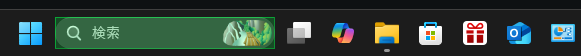
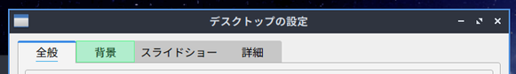

#  GrabUIText <small>(v1.1.0)</small>

A free tool for grabbing UI text from under the mouse cursor.
Designed for language learners who have just switched their OS to the target language.
It lets you copy, translate, and read aloud UI text with simple keyboard shortcuts. It doesn't use OCR. Instead, it uses native OS functions to retrieve the raw text.

<br>
<small>"スタート", "検索", "タスク ビュー", "Copilot 固定済み" etc., ... from the Windows Search Bar</small>

<br>
<small>"全般", "背景", "スライドショー", "詳細" from "デスクトップの設定" in Lubuntu</small>

## Features

- Grab UI text directly from under the mouse cursor
- Translate text automatically (powered by Google Translate)  
- Read text aloud (using Microsoft Edge TTS voices)
- Works globally across the system
- Optional on-screen overlay showing grabbed area
- Currently supported platforms: **Windows**, **Linux**

## Installation

### Windows

1. Install Python (if it's not already installed): https://www.python.org/downloads/
2. Download the repository and unzip it somewhere (for example, into a `grab-ui-text` directory), or clone it using Git:
```bash
git clone https://github.com/zegalur/grab-ui-text.git
cd grab-ui-text
```
3. (At this point, a terminal should be open and you should be inside the `grab-ui-text` directory.)
4. Install the dependencies:
```bash
pip install -r requirements-windows.txt
```
5. (Optional) Create a (desktop) shortcut to `GrabUIText.bat` and set its icon to `other/logo.ico`.
6. (Optional) For [Yomitan](https://yomitan.wiki/) users, you can turn ON the "Enable background clipboard text monitoring" option in Yomitan - a Yomitan pop-up window will appear whenever a UI text is copied.

### Linux

1. Make sure Python is installed.
2. Download the repository and unzip it somewhere (for example, into a `grab-ui-text` directory), or clone it using Git:
```bash
git clone https://github.com/zegalur/grab-ui-text.git
cd grab-ui-text
```
3. (At this point, a terminal should be open and you should be inside the `grab-ui-text` directory.)
4. Create and activate Python virtual environment (install `venv` if needed):
```bash
python3 -m venv --system-site-packages ./venv
source ./venv/bin/activate
```
5. Install the dependencies:
```bash
pip3 install -r requirements-linux.txt
```
6. *Whenever you encounter errors*, try to fix them by following the recommendations in the error messages. Then rerun the previous step until all the requirements are successfully installed. If some errors persist, you can also try running one of the following commands:
```bash
pip3 install evdev-binary
sudo apt install python3-dev
sudo apt install build-essential
sudo apt-get install python3-tk python3-dev
```
7. (Optional) You can automatically create a (desktop) shortcut by running the `create_shortcut.sh`.
8. (Optional) For [Yomitan](https://yomitan.wiki/) users, you can turn ON the "Enable background clipboard text monitoring" option in Yomitan - a Yomitan pop-up window will appear whenever a UI text is copied.

## Usage

1. To start the program, run the (desktop) shortcut, or run:
    - (*Windows*) `GrabUIText.bat`
    - (*Linux*) `GrabUIText.sh`
2. A console window will open. 
3. After a short moment, the icon  will appear in the system tray, and you should see `READY!` in the console.
4. You can now use the app. Hover the mouse cursor over the UI text you want to grab, read, or translate, and use one of the shortcuts.
5. Right-click the tray icon to access the app controls.
6. A history of all grabbed text is available in the console window.
7. **Translation and text-to-speech require an Internet connection.**

## Default shortcuts

| Shortcut             | Action                        |
|----------------------|-------------------------------|
| `Ctrl + Alt + C`     | Copy UI text under cursor     |
| `Ctrl + Alt + S`     | Read UI text aloud            |
| `Ctrl + Alt + T`     | Translate text and read aloud |

The overlay will highlight the grabbed element in green.

## ⚙️ Configuration

All configurable settings are at the top of `grab-ui.py`:

- `VOICE` and `VOICE_TR` - TTS voices  
- `TR_FROM` and `TR_TO` - translation languages  
- `COPY_TEXT_CMD`, `SAY_TEXT_CMD`, `TR_TEXT_CMD` - hotkeys  
- `OVERLAY_BORDER_COLOR` - overlay color  
- `MP3_COUNT` - MP3 buffering for playback

## Limitations

- Because GrabUIText doesn't use OCR, it works only with applications that render their UI using the OS's native API. 
- **Translation and text-to-speech require an Internet connection.**

## Troubleshooting

1. Sometimes text from a window isn’t available because GrabUIText doesn’t have permission to analyze that window. If you really need it, try running the script in Administrator mode.
2. (*Linux*) No transparency - try these commands:
```bash
sudo apt install picom
picom --config /dev/null &
```

## License

Python script is licensed under CC BY 4.0<br>
*Pavlo Savchuk 2025*

Music files are not covered by the open-source license of this project.<br>
See `other/LICENSE-music` for more details.
